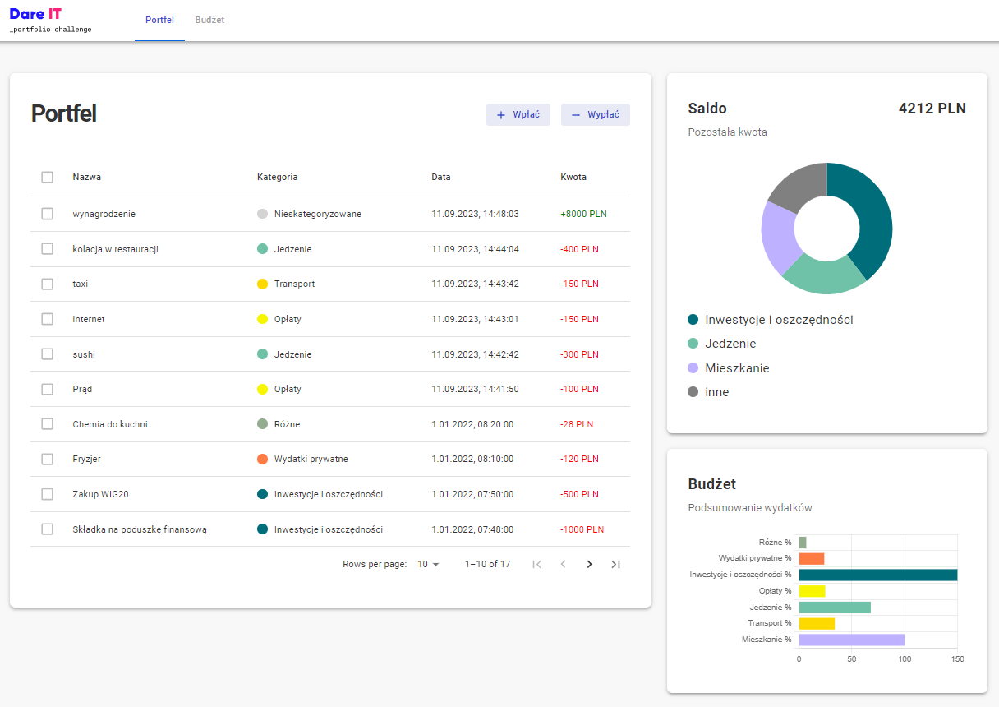

# About the project

The project was created as a part of the React Challenge v2 conducted by Dare IT - an organization supporting women to start career in the IT industry :cherry_blossom:

Saving App is an application enabling to control household budget by adding everyday incomes and spendings. The balance between these two is visualized on a chart.

The goal of the challenge was to create a React app using some popular libraries, workshops, design and testing tools and communicate with the server using REST API.

## Deployed back-end application on Render.com and front-end on Netlify.com

You can check it out here: [Savings App](https://savings-application.netlify.app/) :rocket:

## Built with

[][react-url]

[][react-query-url]
[][react-router-url]
[][react-hook-form-url]
[][mui-url]
[][storybook-url]
[][chartjs-url]
[][cypress-url]
[][swagger-url]
[][vsc-url]
[][figma-url]
[][git-url]

# Getting started

## Installation of npm packages

From the root of the react-challenge repository, launch a terminal and then run the following command

        npm i

⏳ installation may took some time ⏳

Pay attention to `[install:client]` and `[install:server]`, two applications are being installed at the same time - the client, where tasks will be performed, and the server, which will supply the front-end application with data.

## 🏃 Launching the application

### 🔗 Client and Server always together

The repository is constructed in such a way that the client application and the server application are run simultaneously. This is required because one without the other will not function properly.

From the root of your repository, launch a terminal and execute the command:

        npm run start

This command will launch 2 applications which will be available at the following addresses:

- client - front-end application - http://localhost:3000
- server - back-end application - http://localhost:4320
  - API documentation is available at http://localhost:4320/swagger

### Storybook

Storybook is for working on components in isolation. If you want to make changes to the appearance or functioning of individual components, you must edit the corresponding files in the `client/src/ui` directory.

To run the storybook, run the following command from the root of your repository:

        npm run storybook

This command will launch the Storybook application, which will be available at http://localhost:6006

## 🏃 Starting automatic tests

To run the tests, start the client and the server as before, run the command from the root directory:

        npm run cypress:open

This command will launch the Cypress panel where you can run all or selected tests.

# FAQ

## How to add new npm package?

Launch a terminal, go to the `/client` directory and type `npm i :package-name`

<!-- MARKDOWN LINKS & IMAGES -->

[react-url]: https://reactjs.org/
[react-query-url]: https://tanstack.com/query/v3/
[react-router-url]: https://reactrouter.com/en/main
[react-hook-form-url]: https://react-hook-form.com/
[mui-url]: https://mui.com/material-ui/
[storybook-url]: https://storybook.js.org/
[chartjs-url]: https://react-chartjs-2.js.org/
[cypress-url]: https://www.cypress.io/
[swagger-url]: https://swagger.io/tools/swagger-ui/
[vsc-url]: https://code.visualstudio.com/
[figma-url]: https://www.figma.com/
[git-url]: https://git-scm.com/
